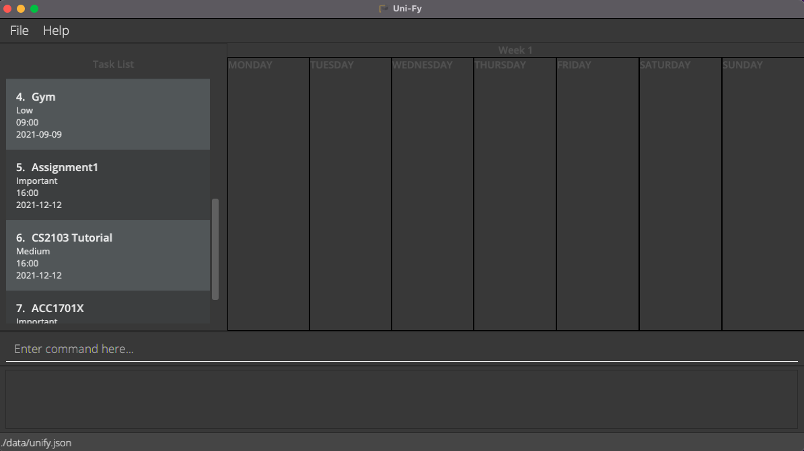
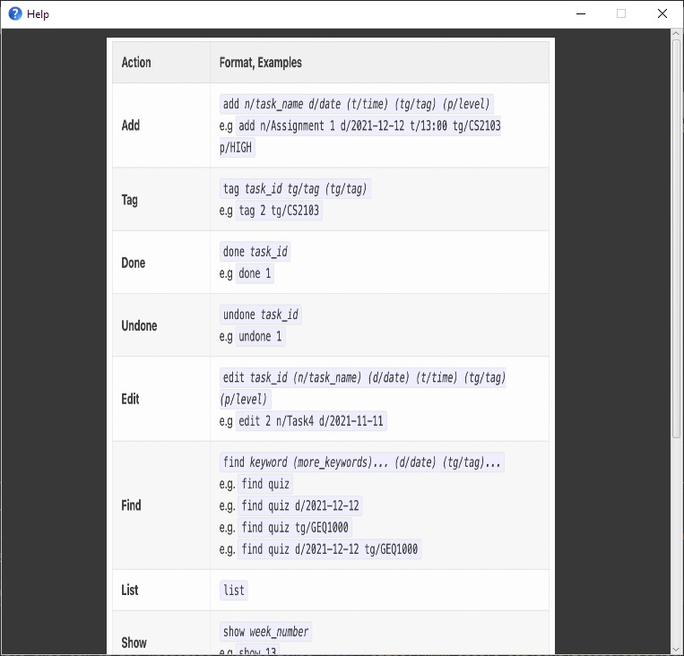
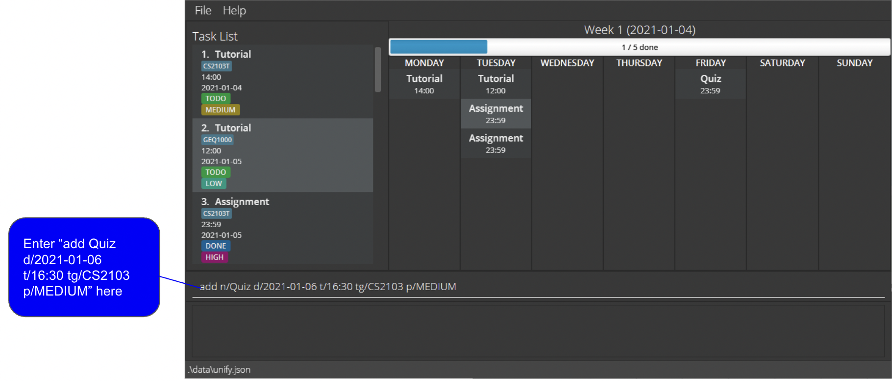
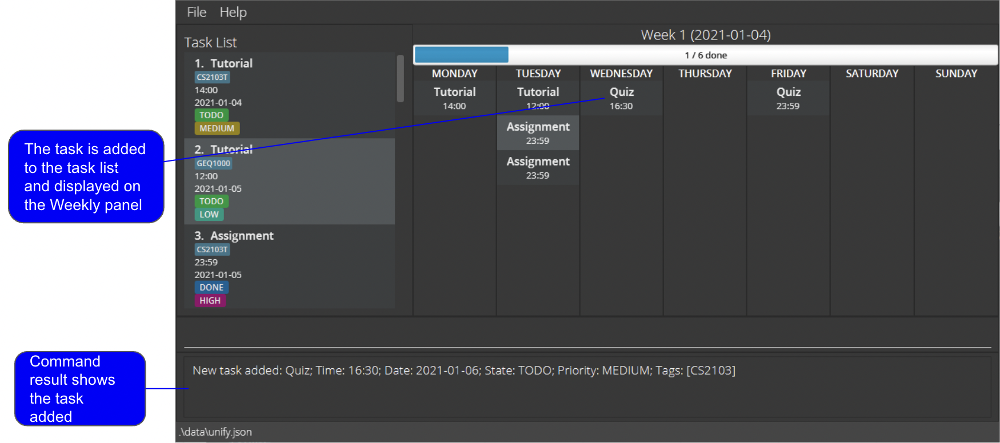
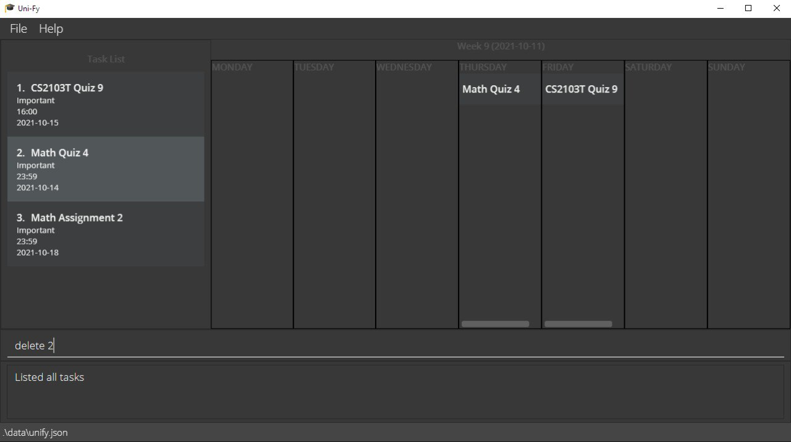

* Table of Contents
{:toc}
--------------------------------------------------------------------------------------------------------------------

## 1. Introduction

Uni-Fy is a **desktop app for managing tasks, optimized for use via a Command Line Interface** (CLI) 
while still having the benefits of a Graphical User Interface (GUI). 
If you can type fast, Uni-Fy can get your tasks to display faster than traditional GUI apps.

Interested to know more? Take a look at our Quick Start guide. Enjoy!

--------------------------------------------------------------------------------------------------------------------
## 2. About this document

Welcome to the Uni-Fy User Guide!

If you are new to Uni-Fy, this user guide will get you up and running in no time! It equips you with the basic 
knowledge you need to use Uni-Fy properly. 

--------------------------------------------------------------------------------------------------------------------

## 3. Formatting

The Uni-Fy user guide contains different formatting used throughout the document which is used to convey different meanings.
This table below illustrates what each formatting means. 

| Formatting    | What                            | Meaning   | Example                     |
| ----------    |-------------------------------------|-----------|--------------------------|
| `add`      | Words in light-blue highlight, also known as a mark-up| A command that can be typed into Uni-Fy|`help`|
| `n/TASK_NAME` | Words in UPPER_CASE | A parameter to be supplied by the user |`n/CS3243`|
| `n/TASK_NAME [tg/TAG_LEVEL]` | Words in square brackets| Optional parameter |`n/CS3243` or   `n/CS3243 tg/Important` |
| `[tg/TAG_LEVEL]…` | Words with `…` after them| Parameters that can be input multiple times including 0 times|`tg/Important tg/Assignment` or `tg/Urgent `|
| [**Blue underline**](#2-about-this-document)| Bold blue words that show underline on mouse-over| A clickable hyperlink, to either an external webpage or other parts of this User Guide|[**1. Introduction**](#1-introduction)|

--------------------------------------------------------------------------------------------------------------------

## 4. Getting started

1. Ensure you have Java `11` or above installed in your Computer.

1. Download the latest `Uni-Fy.jar` from [here](https://github.com/AY2122S1-CS2103T-W17-4/tp/releases).

1. Copy the file to the folder you want to use as the _home folder_ for your app.

1. Double-click the file to start the app. The GUI similar to the below should appear in a few seconds. Note how the app contains some sample data. 
   

1. Type the command in the command box and press Enter to execute it.
   * Refer to the [**Features**](#3-features) below for details of each command.

--------------------------------------------------------------------------------------------------------------------

## 5. Features

This section highlights all the commands that Uni-Fy supports. These include details about the format of the command and example scenarios of each command. 

**:information_source: Notes about the command format:** 

* Italicised words represent parameters that are meant to be supplied by the user
   * e.g. in <code>add *n/task_name d/date*</code>, the <code>*task_name*</code> keyword represents a task and the *date* keyword represents a date, both to be inputted by the user

* Items inside round brackets are optional
   * e.g. in <code>delete *n/task_name (d/date)*</code>, a user can choose to include the date for the task if there are multiples of it

* In user inputted commands:
   * Items with <code>n/</code> before them represent the exact name of the task
   * Items with <code>tg/</code> before them represent the tag of the task
   * Items with <code>d/</code> before them represent the date of the task
   * Items with <code>t/</code> before them represent the time of the task
    * Date is represented in YYYY-MM-DD format
    * Time is represented in HH:MM format

### 5.1 Viewing help : `help`

Shows a message explaining how to access the help page.

Format: `help`

### 5.2 Adding a task: `add` 

Add a task to the task list.

After running the add command the task gets added to the task list as shown below:

Format:
- <code> add <i>n/task_name t/time d/date tg/level </i> </code>

Interpretation
* Adds task with the name <code><i>n/task_name</i></code>
* Adds task with the time <code><i>t/time</i></code> 
  * The format should be as follows <code><i>t/hh:mm</i></code>
* Adds task with the date <code><i>d/date</i></code>
  * The format should be as follows <code><i>d/yyyy-mm-dd</i></code>
* Add task with the tag <code><i>tg/level</i></code>
* The task is added for that date only at the given time
  * Useful if it is an event or for marking dates for exams

Examples:
* `add n/CS2103 test t/16:30 d/2021-12-01 tg/Important ` adds the `CS2103 test` task on `2021-12-01`, scheduled for `16:30` with the priority set as `Important`

### 5.3 Locating a task by name: `find`

Find tasks with matching keywords and show them in the task list.

After running the find command, the tasks having the mentioned keyword are displayed as shown below:

Format: `find keyword (more_keywords) (d/date)`

Interpretation:
* The search is case-insensitive.
* The order of the keywords does not matter.
* Only the name of the task is searched.
* Incomplete keywords will be matched e.g. Qu will match Quiz
* Only tasks containing all keywords will be shown
* if `d/date` field is provided:
  * Only tasks due on that date is searched.

Examples:
* `find quiz` returns CS2103 Quiz, GEQ1000 Quiz 1, GEQ1000 Quiz 2
* `find Quiz GEQ1000` returns GEQ1000 Quiz 1,  GEQ1000 Quiz 2
* `find Quiz GEQ1000 d/2021-10-10` returns all the GEQ1000 Quiz that is due by 2021-10-10

### 5.4 Showing Tasks: `show` (coming soon)

Show all tasks that have been added to the app in a specific week.

Format:
- <code> show <i>week_number</i> </code>
- <code> show <i>d/date</i> </code>

Interpretation
* If <code><i>week_number</i></code> field is provided:
  * Searches for the task with the given date and show it on the GUI
  * Useful in cases where user wants to show all tasks in the given week
* If <code><i>d/date</i></code> field is provided:
  * Show tasks matching the given the date

Examples:
* `show 1` displays tasks in week `1`
* `show d/2021-10-10` displays the tasks in the week of `2021-10-10`

### 5.5 Setting Priority Level for Tasks: `tag` (coming soon)

Set a task's priority.

Format:
- <code> <i> tag n/task_name (d/date) tg/level </i> </code>
- <code> <i> tag task_id (d/date) tg/level </i> </code>

Interpretation
* If <code><i>n/task_name</i></code> field is provided:
  * Depending on the <code><i>tg/level </i></code> provided it sets priority of the task with the name exactly matching the <code><i>n/task_name </i></code> or <code><i>task_id</i></code> to
    * Urgent
    * Important
    * Medium
    * Low
  * The <code><i>tg/level</i></code> field is case-insensitive
  * If <code><i>date</i></code> field is provided, it sets priority for the task in the given date
    * Useful in cases when there are multiple copies of the same task , recurring tasks, etc.
  * If <code><i>d/date</i></code> field is not provided, it sets priority for every occurrence of tasks matching the given name

* If <code><i>task_id</i></code> is provided:

Examples:
* `tag 5 tg/Urgent` sets the priority of task 5 in the task list to `Urgent`
* `tag n/quiz d/2021-10-10 tg/Important` sets priority of the quiz task on 2021-10-10 to `Important`

### 5.6 Deleting tasks : `delete` (coming soon)

Delete a specific task that has been added to your app.

After running the delete command, the task at that particular index gets deleted as shown below:

Format:
- <code> delete <i>task_id (task_id)</i> </code>

Interpretation
* Deletes the task corresponding to the <code><i>task_id</i></code>
* Deletes the tasks corresponding to the <code><i>task_ids</i></code> provided if multiple are provided

Examples:
* `delete 3` removes the third item in the task list
* `delete 1 2` removes the first and second items in the task list

### 5.7 Deleting all tasks : `clear`

Clears all entries from the Uni-Fy app.

When you run the clear command, all the tasks in the task list of Uni-Fy get deleted as shown below:

Format: `clear`

### 5.8 Undoing the previous command : `undo` `[coming in v1.3]`

Reverts your previous command which modified the task list of Uni-Fy.

Format: `undo`

### 5.9 Exiting the program : `exit`

Exits the program.

Format: `exit`

### 5.10 Saving the data

**Uni-Fy** data are saved in the hard disk automatically after any command that changes the data. There is no need to save manually.

### 5.11 Editing the data file

**Uni-Fy** data are saved as a JSON file `[JAR file location]/data/unify.json`. Advanced users are welcome to update data directly by editing that data file.

:exclamation: **Caution:**
If your changes to the data file makes its format invalid, Uni-Fy will discard all data and start with an empty data file at the next run.

### 5.12 Retrieving past commands `[coming in v1.3]`

Shows the past commands run on **Uni-Fy**.

Format: `history`

:exclamation: **Caution:**
Your history is erased when you close and reopen the app. Do not close the app if you have anything in the history that you need to refer to later.

### 5.13 Archiving data files `[coming in v2.0]`

_Details coming soon ..._

--------------------------------------------------------------------------------------------------------------------

## 6. FAQ

**Q**: What are the minimum system requirements for this application? 
**A**: If your computer runs any of the Operating Systems found [here](https://www.oracle.com/java/technologies/javase/products-doc-jdk11certconfig.html), you will be able to run **Uni-Fy**.

**Q**: How do I transfer my data to another Computer? 
**A**: Install the app in the other computer and overwrite the empty data file it creates with the file that contains the data of your previous Tasks home folder.

**Q**: Is the source code of this application freely available? 
**A**: Yes, our code is available on our [GitHub repository](https://github.com/AY2122S1-CS2103T-W17-4/tp) under the MIT License. If you wish to contribute to the codebase of this application, please read the [Developer Guide](https://ay2122s1-cs2103t-w17-4.github.io/tp/DeveloperGuide.html) and make a pull request to our repository.

**Q**: I've spotted a bug in your application. How can I report this? 
**A**: We would love to hear from you. You can make a GitHub issue at this [link](https://github.com/AY2122S1-CS2103T-W17-4/tp/issues) with the relevant details.

**Q**: Is my data secure with this application? 
**A**: Your data is stored safely on your machine. **Uni-Fy** stores the data locally and does not upload any data to servers on the Internet. However, you are recommended to use antivirus software on your machine to prevent unauthorised hackers from accessing the local database.

--------------------------------------------------------------------------------------------------------------------

## 7. Command summary

Action | Format, Examples
--------|------------------
**Add** | <code>add <i>n/task_name t/time d/date tg/level</i></code>  e.g `add n/CS3243_Assignment t/13:00 d/2021-12-12 tg/Important`
**Delete** | <code>delete <i>task_id (task_id)</i></code>   e.g. <code>delete 1 2 3 </code>
**Show** | `show week_number `
**Edit** | `TODO`
**Find** | <code>find <i>keyword (more_keywords) (d/date)</i></code>   e.g. `find Quiz GEQ1000 d/2021-10-10`
**Tag** | `TODO`
**Help** | `help`
**Retrieve past Commands** | `history`
**Clear** | `clear`
**Undo** | `TODO`
